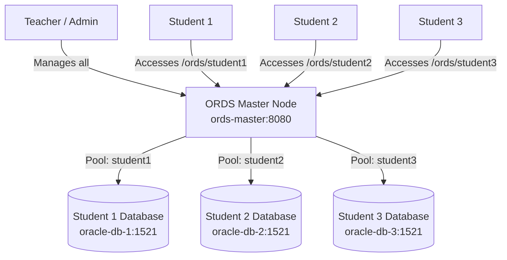

# Multi-Tenant Student Oracle RDBMS & Swarm Fleet Infrastructure

This repository provides an enterprise-grade Oracle Database management solution designed for educational computer labs and university environments. It supports two primary deployment modes:

1. **Enterprise Docker Swarm Global Services Fleet (100+ Student PCs)**: A hardened, orchestrator-managed lab deployment where every student PC hosts an isolated Oracle Database container bound strictly to loopback (`127.0.0.1:1521`), integrated with a local Master image registry for ultra-fast Gigabit LAN distribution and 1-click desktop shortcuts.
2. **Local Multi-Tenant Web Client Prototype (ORDS Master Node)**: A single-node Docker Compose prototype hosting separate Oracle RDBMS instances for multiple students managed by **Oracle SQL Developer Web (Database Actions)** via **Oracle REST Data Services (ORDS)** on port `8080`.

---

## High-Level Architecture Overview

### Mode 1: Docker Swarm Global Services Architecture (100+ Student PCs)

```mermaid
graph TD
    subgraph Master PC Node (192.168.1.10)
        MasterInit[master-setup.sh / .ps1] -->|Initializes| SwarmManager[Docker Swarm Manager]
        SwarmManager -->|Runs| Registry[Local Registry :5000]
        DeployScript[deploy-stack.sh / .ps1] -->|Deploys stack| StackDef[docker-stack.yml]
    end

    subgraph Internal Network
        Registry -->|Gigabit Image Push/Pull| OverlayNet[admin_internal_net overlay]
    end

    subgraph Student PC Node 1 (Worker)
        StudentInit1[student-setup.sh / .ps1] -->|Joins Swarm| Worker1[Docker Worker Node]
        Worker1 -->|Mode: Global Task| Container1[oracle-db Container<br>Limit: 3GB RAM / 2 CPU]
        Shortcut1[1-Click Desktop Shortcut] -->|Connects| Loopback1[127.0.0.1:1521/XEPDB1]
        Loopback1 --> Container1
    end

    subgraph Student PC Node N (Worker 100+)
        StudentInitN[student-setup.sh / .ps1] -->|Joins Swarm| WorkerN[Docker Worker Node]
        WorkerN -->|Mode: Global Task| ContainerN[oracle-db Container<br>Limit: 3GB RAM / 2 CPU]
        ShortcutN[1-Click Desktop Shortcut] -->|Connects| LoopbackN[127.0.0.1:1521/XEPDB1]
        LoopbackN --> ContainerN
    end

    SwarmManager -->|Orchestrates Tasks| Worker1
    SwarmManager -->|Orchestrates Tasks| WorkerN
```

### Mode 2: Single-Node Multi-Tenant ORDS Web Architecture (Prototype)



---

## Directory & File Map

| File / Path | Type | Description |
| :--- | :--- | :--- |
| [docker-stack.yml](file:///home/xotem/projects/vitdbms/docker-stack.yml) | Swarm Stack | Defines the Swarm Global Service deployment (`oracle-db`), loopback port binding (`127.0.0.1:1521`), resource limits (3GB RAM, 2 CPUs), and internal overlay network. |
| [docker-compose.yml](file:///home/xotem/projects/vitdbms/docker-compose.yml) | Compose Spec | Configures the single-node prototype with 3 student DB containers and 1 ORDS web master node. |
| [Dockerfile.ords](file:///home/xotem/projects/vitdbms/Dockerfile.ords) | Dockerfile | Builds the ORDS Master image on Java 17, downloading and setting up Oracle REST Data Services. |
| [entrypoint.sh](file:///home/xotem/projects/vitdbms/entrypoint.sh) | Bash Script | Entrypoint for the ORDS master container that configures global settings and silent pool installation. |
| [init-db.sh](file:///home/xotem/projects/vitdbms/init-db.sh) | Bash Script | Database initialization script for Oracle containers; creates local schemas and auto-enables ORDS REST services. |
| **`scripts/` Directory** | Script Suite | Automation scripts for Master node initialization, Student PC setup, and stack deployment. |
| ├── [master-setup.sh](file:///home/xotem/projects/vitdbms/scripts/master-setup.sh) | Bash Script | Initializes Docker Swarm Manager, creates overlay network, starts local registry on port 5000, and pushes seed image. |
| ├── [master-setup.ps1](file:///home/xotem/projects/vitdbms/scripts/master-setup.ps1) | PowerShell | Windows equivalent for Master node initialization. |
| ├── [master-setup.bat](file:///home/xotem/projects/vitdbms/scripts/master-setup.bat) | CMD Batch | Windows CMD equivalent for Master node setup without PowerShell. |
| ├── [student-setup.sh](file:///home/xotem/projects/vitdbms/scripts/student-setup.sh) | Bash Script | Audits user groups, joins student node to Swarm cluster, and creates transparent Desktop SQL*Plus shortcut. |
| ├── [student-setup.ps1](file:///home/xotem/projects/vitdbms/scripts/student-setup.ps1) | PowerShell | Windows equivalent for Student PC automated setup. |
| ├── [student-setup.bat](file:///home/xotem/projects/vitdbms/scripts/student-setup.bat) | CMD Batch | Windows CMD equivalent for Student PC setup without PowerShell. |
| ├── [deploy-stack.sh](file:///home/xotem/projects/vitdbms/scripts/deploy-stack.sh) | Bash Script | Deploys/updates the [docker-stack.yml](file:///home/xotem/projects/vitdbms/docker-stack.yml) stack on Swarm and monitors fleet health. |
| ├── [deploy-stack.ps1](file:///home/xotem/projects/vitdbms/scripts/deploy-stack.ps1) | PowerShell | Windows equivalent for Swarm stack deployment. |
| ├── [deploy-stack.bat](file:///home/xotem/projects/vitdbms/scripts/deploy-stack.bat) | CMD Batch | Windows CMD equivalent for stack deployment without PowerShell. |
| ├── [run-batch-admin.sh](file:///home/xotem/projects/vitdbms/scripts/run-batch-admin.sh) | Bash Script | Runs automated administrative SQL queries across all running container tasks. |
| ├── [run-batch-admin.ps1](file:///home/xotem/projects/vitdbms/scripts/run-batch-admin.ps1) | PowerShell | Windows equivalent for batch administrative queries. |
| └── [run-batch-admin.bat](file:///home/xotem/projects/vitdbms/scripts/run-batch-admin.bat) | CMD Batch | Windows CMD equivalent for batch administrative queries without PowerShell. |
| **`docs/` Directory** | Documentation | Comprehensive operational documentation and troubleshooting guides. |
| ├── [ARCHITECTURE.md](file:///home/xotem/projects/vitdbms/docs/ARCHITECTURE.md) | Markdown | Deep dive system architecture specification for Swarm Global Services. |
| ├── [PHASE1_MASTER_SETUP.md](file:///home/xotem/projects/vitdbms/docs/PHASE1_MASTER_SETUP.md) | Markdown | Detailed guide for initializing the Swarm Master node and local registry. |
| ├── [PHASE2_STUDENT_SETUP.md](file:///home/xotem/projects/vitdbms/docs/PHASE2_STUDENT_SETUP.md) | Markdown | Step-by-step guide for configuring student nodes and desktop shortcuts. |
| ├── [PHASE3_OPERATIONS.md](file:///home/xotem/projects/vitdbms/docs/PHASE3_OPERATIONS.md) | Markdown | Operational procedures for stack deployment, grading loops, and lifecycle management. |
| ├── [RESTRICTED_POWERSHELL_GUIDE.md](file:///home/xotem/projects/vitdbms/docs/RESTRICTED_POWERSHELL_GUIDE.md) | Markdown | Guide for operating the entire lab on Windows machines with blocked PowerShell script execution policies. |
| ├── [TROUBLESHOOTING.md](file:///home/xotem/projects/vitdbms/docs/TROUBLESHOOTING.md) | Markdown | In-depth troubleshooting guide for port conflicts, Swarm firewall issues, overlay networking, health checks, local registry pulls, `ORA-*` errors, and PowerShell execution blocks. |
| └── [COMPARISON_MATRIX.md](file:///home/xotem/projects/vitdbms/docs/COMPARISON_MATRIX.md) | Markdown | Technical operational matrix comparing Standard Unhardened Setup vs Hardened Swarm Lab Setup across 6 core security and UX dimensions. |

---

## Quickstart Guide

### Option A: Hardened Docker Swarm Deployment (100+ Lab PCs)

> [!IMPORTANT]
> Ensure all Master and Student PCs are connected to the local lab network and have Docker installed.

#### Step 1: Master PC Initialization
Run the initialization script on the Master PC to create the Swarm cluster and start the local image registry:

- **Linux / Git Bash**:
  ```bash
  chmod +x scripts/*.sh
  ./scripts/master-setup.sh "192.168.1.10" "oracle-xe:latest"
  ```
- **Windows (PowerShell Admin)**:
  ```powershell
  .\scripts\master-setup.ps1 -AdvertiseAddr "192.168.1.10" -SourceImage "oracle-xe:latest"
  ```
- **Windows (CMD .bat - No PowerShell)**:
  ```cmd
  scripts\master-setup.bat 192.168.1.10 oracle-xe:latest
  ```

*Note down the Worker Join Token printed in the command output.*

#### Step 2: Student PC Setup
On each Student PC (or executed via lab deployment tools like Ansible/SCCM):

- **Linux / Git Bash**:
  ```bash
  ./scripts/student-setup.sh "<SWARM_WORKER_JOIN_TOKEN>" "192.168.1.10:2377" "student"
  ```
- **Windows (PowerShell Admin)**:
  ```powershell
  .\scripts\student-setup.ps1 -SwarmToken "<SWARM_WORKER_JOIN_TOKEN>" -ManagerAddr "192.168.1.10:2377" -StudentUser "student"
  ```
- **Windows (CMD .bat - No PowerShell)**:
  ```cmd
  scripts\student-setup.bat <SWARM_WORKER_JOIN_TOKEN> 192.168.1.10:2377 student
  ```

This joins the machine to the Swarm cluster, removes the student user from control groups, and creates a **1-Click SQL*Plus Shortcut** on the Desktop.

#### Step 3: Deploy the Lab Stack
From the Master PC, deploy the global stack definition to all 100+ student nodes simultaneously:

- **Linux / Git Bash**:
  ```bash
  ./scripts/deploy-stack.sh "lab" "docker-stack.yml"
  ```
- **Windows (PowerShell)**:
  ```powershell
  .\scripts\deploy-stack.ps1 -StackName "lab" -StackFile "docker-stack.yml"
  ```
- **Windows (CMD .bat - No PowerShell)**:
  ```cmd
  scripts\deploy-stack.bat lab docker-stack.yml
  ```

#### Step 4: Verify Deployment
Inspect the status of running tasks across the lab fleet:
```bash
docker service ps lab_oracle-db --filter "desired-state=running"
```

---

### Option B: Local Multi-Tenant Web Prototype (Single Machine / ORDS)

> [!NOTE]
> Use this mode for testing SQL Developer Web in a web browser without setting up a full Docker Swarm cluster.

1. **Start the Environment**:
   ```bash
   docker compose up --build
   ```
2. **Access Credentials & Web URLs**:

| Role | Target Database | Web URL | Username | Password |
| :--- | :--- | :--- | :--- | :--- |
| **Student 1** | `oracle-db-1` | [http://localhost:8080/ords/student1/sql-developer](http://localhost:8080/ords/student1/sql-developer) | `STUDENT` | `StudentPassword123` |
| **Student 2** | `oracle-db-2` | [http://localhost:8080/ords/student2/sql-developer](http://localhost:8080/ords/student2/sql-developer) | `STUDENT` | `StudentPassword123` |
| **Student 3** | `oracle-db-3` | [http://localhost:8080/ords/student3/sql-developer](http://localhost:8080/ords/student3/sql-developer) | `STUDENT` | `StudentPassword123` |
| **Teacher** | `oracle-db-1` | [http://localhost:8080/ords/student1/sql-developer](http://localhost:8080/ords/student1/sql-developer) | `TEACHER` | `OraclePassword123` |

> [!TIP]
> Username MUST be entered in **ALL-UPPERCASE** (`STUDENT` or `TEACHER`) when signing into Oracle SQL Developer Web.

3. **Cleanup**:
   ```bash
   docker compose down -v
   ```

---

## Security & Operations Summary

For detailed diagnostic procedures, performance comparisons, and architecture details, refer to:
- 📖 [TROUBLESHOOTING.md](file:///home/xotem/projects/vitdbms/docs/TROUBLESHOOTING.md) — Comprehensive troubleshooting guide for ports, Swarm connections, overlay networks, and `ORA-*` error handling.
- 📊 [COMPARISON_MATRIX.md](file:///home/xotem/projects/vitdbms/docs/COMPARISON_MATRIX.md) — Architectural comparison matrix highlighting security, performance, and UX advantages of the Swarm Lab setup.
