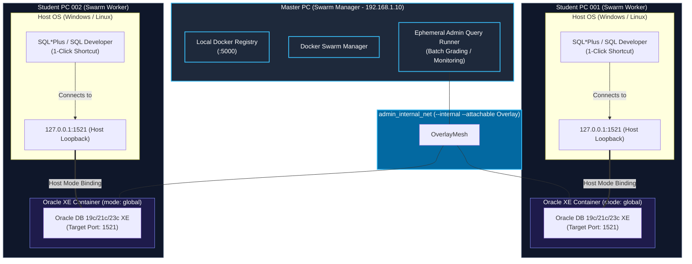

# System Architecture: Multi-Node Global Oracle Swarm Deployment

This document outlines the architecture, network isolation design, resource allocation, and threat model for the multi-node student Oracle Database lab environment built on Docker Swarm.

---

## 1. Core Architecture Summary

The system is designed to deploy standard, enterprise-grade Oracle Database Express Edition (XE) containers across a physical computer lab of 100+ Windows/Linux PCs managed from a single Master PC.

```
+-----------------------------------------------------------------------------------+
|                                 PHYSICAL LAN                                      |
|                                                                                   |
|   +-------------------+        +-------------------+        +-------------------+ |
|   |    MASTER PC      |        |   STUDENT PC 001  |        |   STUDENT PC 002  | |
|   |  (Swarm Manager)  |        |   (Swarm Worker)  |        |   (Swarm Worker)  | |
|   |  192.168.1.10     |        |   192.168.1.101   |        |   192.168.1.102   | |
|   +---------+---------+        +---------+---------+        +---------+---------+ |
+-------------|----------------------------|----------------------------|-----------+
              |                            |                            |
              |     =======================|============================|=======
              |    ||             admin_internal_net (Internal Overlay) ||
              v    ||                      v                            v     ||
     +-----------------+          +-----------------+          +-----------------+
     | Ephemeral Admin |          | Oracle XE DB    |          | Oracle XE DB    |
     | Query Runner    |          | Container       |          | Container       |
     +-----------------+          +--------+--------+          +--------+--------+
                                           |                            |
                                  (127.0.0.1:1521)             (127.0.0.1:1521)
                                           v                            v
                                  +-----------------+          +-----------------+
                                  | Student Client  |          | Student Client  |
                                  | (SQL*Plus/Dev)  |          | (SQL*Plus/Dev)  |
                                  +-----------------+          +-----------------+
```

### Key Architectural Pillars

* **Global Docker Swarm Service Model (`mode: global`)**:
  The Oracle Database service (`lab_oracle-db`) is deployed with Docker Swarm's `global` scheduling mode. This guarantees that **exactly one** Oracle XE container is deployed and executed on every active worker node (student PC) in the cluster automatically upon joining.

* **Host Loopback Port Binding (`127.0.0.1:1521`)**:
  Using `mode: host` and `host_ip: 127.0.0.1` in the Compose/Stack definition forces Docker to bind container port `1521` directly and exclusively to the local loopback interface (`127.0.0.1`) of each physical host PC.

* **Internal Attachable Overlay Network (`admin_internal_net`)**:
  An overlay network created with the `--internal` and `--attachable` flags spans across all Swarm nodes. It enables central management, automated grading, and health monitoring from the Master PC without exposing container IP addresses or database ports to the physical local area network (LAN).

---

## 2. Security & Network Isolation

> [!IMPORTANT]
> A primary requirement of the lab environment is preventing students from connecting to or interfering with peer databases across the physical network, while maintaining administrative oversight from the Master PC.

### Socket-Level Loopback Binding (Cross-PC Isolation)

Standard Docker Swarm ingress routing meshes publish ports globally across all nodes on all physical network interfaces. In contrast, our architecture bypasses the ingress routing mesh by enforcing **host-mode loopback binding**:

```yaml
ports:
  - "127.0.0.1:1521:1521"
```

* **Why Cross-PC Access Over Physical LAN is Impossible**:
  Because the socket listener binds strictly to `127.0.0.1:1521`, the operating system network stack will reject any incoming TCP packets addressed to the PC's physical LAN IP (e.g., `192.168.1.101:1521`). Student A on PC 101 cannot reach Student B's database on PC 102 under any circumstances over the physical network.

### Container Pivoting & Escalation Defense

```
+-----------------------------------------------------------------------------------+
| SECURITY THREAT & MITIGATION                                                      |
+-----------------------------------------------------------------------------------+
| ATTACK VECTOR                      | MITIGATION ENFORCED                          |
+------------------------------------+----------------------------------------------+
| Student attempts outbound LAN/WAN  | Overlay network created with `--internal`    |
| traffic from container             | flag (no default gateway or outbound routing)|
+------------------------------------+----------------------------------------------+
| Student attempts `docker exec`     | Student Windows domain accounts removed from |
| to bypass host restrictions        | `docker-users` group (restricted privilege)  |
+------------------------------------+----------------------------------------------+
```

1. **`--internal` Overlay Protection**:
   The `admin_internal_net` overlay network is created with the `--internal` driver flag. Containers attached to this network are isolated from outside network communication: no external default gateway is configured on the overlay network interface.
2. **`docker-users` Group Audit**:
   On Windows host PCs, membership in the local `docker-users` group grants full control over the Docker daemon API (which is equivalent to Administrator access). Unprivileged student user accounts **must be removed** from the `docker-users` group. Students interact with Oracle solely through local client tools (SQL*Plus, SQL Developer) connecting to `localhost:1521/XEPDB1`.

---

## 3. Resource Caps & Performance Allocation

Running heavy RDBMS engines like Oracle XE across 100+ lab computers requires strict resource boundaries to ensure host OS stability during concurrent lab tasks.

```yaml
deploy:
  resources:
    limits:
      cpus: '2.0'
      memory: 3072M
    reservations:
      memory: 2048M
```

| Parameter | Value | Rationale / Behavioral Impact |
| :--- | :--- | :--- |
| **CPU Limit** | `2.0` cores | Prevents runaway PL/SQL scripts or infinite loops from consuming 100% of all host CPU cores. |
| **Memory Limit** | `3072M` (3 GB) | Sets an absolute ceiling on container memory consumption, protecting host RAM for Windows OS and local client tools. |
| **Memory Reservation** | `2048M` (2 GB) | Guarantees that Swarm schedules nodes with sufficient RAM available to run Oracle SGA/PGA buffers smoothly. |

> [!NOTE]
> Database memory initialization inside the container is configured via environment variables `INIT_SGA_SIZE: "1500M"` and `INIT_PGA_SIZE: "500M"` to stay comfortably within the 3GB limit.

---

## 4. Architectural Diagram

The diagram below depicts the relationship between the Master PC, Student Worker PCs, local host loopback sockets, the internal overlay network, and administrative query runners.


