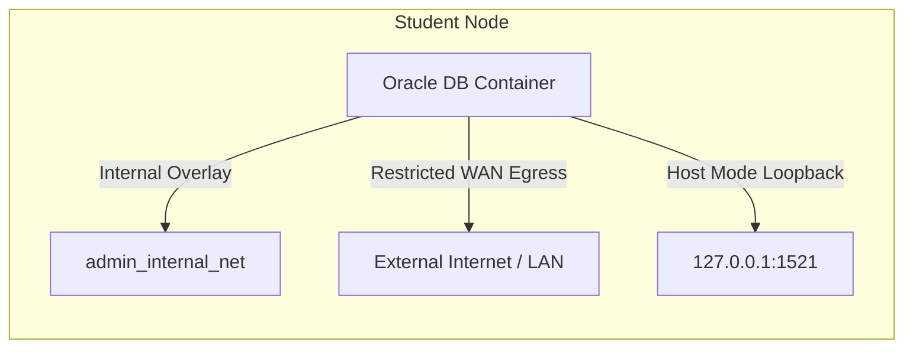
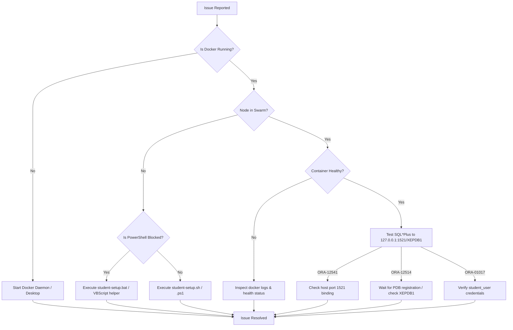

# Docker Swarm & Oracle RDBMS Fleet Troubleshooting Guide

This guide provides comprehensive diagnostic steps, root cause analysis, and resolution procedures for common operational issues encountered in the **Hardened Docker Swarm Lab Setup** and multi-tenant Oracle RDBMS deployment.

---

## Quick Reference Table

| Category | Typical Error / Symptom | Primary Root Cause | Quick Fix Command / Action |
| :--- | :--- | :--- | :--- |
| **Host Port Conflict** | `listen tcp4 127.0.0.1:1521: bind: address already in use` | Host service (`tnslsnr` or local Oracle instance) occupying port 1521 | Terminate host process or stop `OracleServiceXE` |
| **Swarm Join Failure** | `Manager at MASTER_LAN_IP:2377 is unreachable` | Firewall blocking ports `2377`/`7946`/`4789` or incorrect IP | Open Swarm firewall ports on Master node |
| **Overlay Routing** | Container cannot reach external WAN internet | Overlay network `--internal` flag restricting egress | Intended behavior; local registry used via host IP |
| **Healthcheck Timeout** | Container status `unhealthy` / restarting | RAM limit < 2048M causing OOM or slow host disk I/O | Increase memory limit in [docker-stack.yml](file:///home/xotem/projects/vitdbms/docker-stack.yml) |
| **Registry Pull Error** | `http: server gave HTTP response to HTTPS client` | Local Master registry uses plain HTTP on port 5000 | Add `"insecure-registries"` to `/etc/docker/daemon.json` |
| **SQL*Plus Connection** | `ORA-12541: TNS:no listener` / `ORA-12514` | Database starting up or incorrect service name (`XEPDB1`) | Verify container health and check service name |
| **PowerShell Restricted** | `PSSecurityException` / `ExecutionPolicy Restricted` | PowerShell script execution blocked by GPO / system security policy | Run `.bat` scripts ([student-setup.bat](file:///home/xotem/projects/vitdbms/scripts/student-setup.bat)) or VBScript helper |

---

## 1. Host Port 1521 Binding Conflicts

> [!WARNING]
> In [docker-stack.yml](file:///home/xotem/projects/vitdbms/docker-stack.yml), Oracle listener port 1521 is published using `mode: host` bound strictly to loopback (`127.0.0.1:1521`). If another process on the host system is already listening on port 1521, the container task will fail to launch.

### Symptoms
- Docker task failure logs:
  ```text
  Error response from daemon: driver failed programming external connectivity on endpoint lab_oracle-db...: Error starting userland proxy: listen tcp4 127.0.0.1:1521: bind: address already in use
  ```
- Service task status shows `Rejected` or `Failed`.

### Root Cause
An existing local installation of Oracle Database, Oracle XE, or a previous un-removed standalone container is actively running on host port 1521.

### Diagnostic Steps

#### Linux
```bash
# Identify process listening on TCP port 1521
sudo netstat -tulpn | grep 1521
# Or using ss / lsof
sudo ss -tulpn | grep 1521
sudo lsof -i :1521
```

#### Windows (PowerShell)
```powershell
# Get active TCP connections on port 1521
Get-NetTCPConnection -LocalPort 1521 -ErrorAction SilentlyContinue | Select-Object LocalAddress, LocalPort, OwningProcess, State

# Identify process details by PID
Get-Process -Id (Get-NetTCPConnection -LocalPort 1521).OwningProcess
```

### Resolution
1. **Stop Host Oracle Service**:
   - **Linux**: `sudo systemctl stop oracle-xe` or `sudo systemctl stop oracle-free`
   - **Windows**: `Stop-Service -Name "OracleServiceXE"` or `Stop-Service -Name "OracleServiceFREE"`
2. **Remove Conflicting Standalone Container**:
   ```bash
   docker rm -f $(docker ps -q --filter "ancestor=gvenzl/oracle-free")
   ```
3. **Redeploy Stack**:
   Execute [deploy-stack.sh](file:///home/xotem/projects/vitdbms/scripts/deploy-stack.sh) or [deploy-stack.ps1](file:///home/xotem/projects/vitdbms/scripts/deploy-stack.ps1).

---

## 2. Swarm Worker Node Disconnection & Join Failures

> [!IMPORTANT]
> Docker Swarm communication between Manager (Master PC) and Worker nodes (Student PCs) requires bidirectional connectivity across specific TCP/UDP ports over the LAN.

### Symptoms
- Running `docker swarm join` on a student PC fails with:
  ```text
  Error response from daemon: Manager at 192.168.1.10:2377 is unreachable: Step 1/2: connect tcp 192.168.1.10:2377: connect: no route to host / connection timed out
  ```
- On Master node, running `docker node ls` shows student node status as `Down` or `Unknown`.

### Required Docker Swarm Firewall Ports
- **`2377/tcp`**: Swarm cluster management communications.
- **`7946/tcp` & `7946/udp`**: Node-to-node control network communication.
- **`4789/udp`**: Overlay network data traffic (VXLAN).

### Diagnostic Steps
1. **Verify Master IP Reachability**:
   ```bash
   ping -c 3 192.168.1.10
   ```
2. **Test Master Swarm Port 2377**:
   - **Linux**: `nc -zv -w 3 192.168.1.10 2377`
   - **Windows**: `Test-NetConnection -ComputerName 192.168.1.10 -Port 2377`

### Resolution

#### Configure Firewall on Master PC (Linux / UFW)
```bash
sudo ufw allow 2377/tcp comment 'Docker Swarm Management'
sudo ufw allow 7946/tcp comment 'Docker Swarm Node Comm'
sudo ufw allow 7946/udp comment 'Docker Swarm Node Comm'
sudo ufw allow 4789/udp comment 'Docker Swarm Overlay Traffic'
sudo ufw reload
```

#### Configure Firewall on Master PC (Windows PowerShell Admin)
```powershell
New-NetFirewallRule -DisplayName "Docker Swarm Management (2377)" -Direction Inbound -Protocol TCP -LocalPort 2377 -Action Allow
New-NetFirewallRule -DisplayName "Docker Swarm Node Comm TCP (7946)" -Direction Inbound -Protocol TCP -LocalPort 7946 -Action Allow
New-NetFirewallRule -DisplayName "Docker Swarm Node Comm UDP (7946)" -Direction Inbound -Protocol UDP -LocalPort 7946 -Action Allow
New-NetFirewallRule -DisplayName "Docker Swarm Overlay UDP (4789)" -Direction Inbound -Protocol UDP -LocalPort 4789 -Action Allow
```

#### Re-Join Swarm Cluster on Student PC
Run the student initialization script:
- **Linux**: [student-setup.sh](file:///home/xotem/projects/vitdbms/scripts/student-setup.sh) `"<SWARM_JOIN_TOKEN>" "192.168.1.10:2377"`
- **Windows**: [student-setup.ps1](file:///home/xotem/projects/vitdbms/scripts/student-setup.ps1) `-SwarmToken "<SWARM_JOIN_TOKEN>"`

---

## 3. Overlay Network Routing & Internal Flag Behavior

> [!NOTE]
> The overlay network `admin_internal_net` specified in [docker-stack.yml](file:///home/xotem/projects/vitdbms/docker-stack.yml) is created with the `--internal` flag by [master-setup.sh](file:///home/xotem/projects/vitdbms/scripts/master-setup.sh) / [master-setup.ps1](file:///home/xotem/projects/vitdbms/scripts/master-setup.ps1).

### Internal Overlay Network Architecture


### Security & Operational Implications
1. **Egress Restriction**: `--internal` blocks outbound default gateways for containers on this network. Lab containers cannot initiate unauthorized outbound internet connections or exfiltrate data.
2. **Registry Distribution**: Because the overlay network is internal, image distribution from the Master node registry must be accessed via the host LAN network (`192.168.1.10:5000`), NOT through the internal overlay network.
3. **Verification**:
   ```bash
   docker network inspect admin_internal_net --format '{{.Internal}}'
   # Output should be: true
   ```

---

## 4. Container Health Check Failures (`/opt/oracle/healthcheck.sh`)

> [!NOTE]
> Oracle Database initialization is CPU and I/O intensive. If system resources are overly constrained or disk write speeds are slow, the internal health check script `/opt/oracle/healthcheck.sh` may time out before initialization finishes.

### Symptoms
- Container status remains `starting` or becomes `unhealthy`.
- Service tasks are restarted repeatedly by Swarm according to the `restart_policy` in [docker-stack.yml](file:///home/xotem/projects/vitdbms/docker-stack.yml).

### Diagnostic Steps
1. **Inspect Container Health Status**:
   ```bash
   docker inspect --format='{{json .State.Health}}' $(docker ps -q --filter "name=oracle-db") | jq .
   ```
2. **Review DB Startup Logs**:
   ```bash
   docker logs --tail 100 $(docker ps -q --filter "name=oracle-db")
   ```

### Common Causes & Fixes
- **Inadequate Memory Limits**:
  If container memory limit is set below 2048M, Oracle OOM Killer will terminate background database processes (`pmon`, `smon`).
  - *Fix*: Ensure [docker-stack.yml](file:///home/xotem/projects/vitdbms/docker-stack.yml) contains:
    ```yaml
    resources:
      limits:
        memory: 3072M
      reservations:
        memory: 2048M
    ```
- **Insufficient Startup Period**:
  On older student PCs with mechanical HDDs, initial database creation takes longer than 60 seconds.
  - *Fix*: Increase `start_period` in health check configuration to `120s`.

---

## 5. Local Registry Image Pull Failures (`insecure-registries`)

> [!WARNING]
> By default, the Docker Engine blocks pulling container images over unencrypted HTTP connections (`http://192.168.1.10:5000`).

### Symptoms
- Service logs on worker nodes display:
  ```text
  Error response from daemon: Get "https://192.168.1.10:5000/v2/": http: server gave HTTP response to HTTPS client
  ```

### Resolution

#### Linux Host Configuration
1. Edit `/etc/docker/daemon.json`:
   ```json
   {
     "insecure-registries": ["192.168.1.10:5000"]
   }
   ```
2. Restart Docker service:
   ```bash
   sudo systemctl restart docker
   ```

#### Windows (Docker Desktop) Configuration
1. Open **Docker Desktop Settings**.
2. Navigate to **Docker Engine**.
3. Add `"insecure-registries": ["192.168.1.10:5000"]` to the JSON schema:
   ```json
   {
     "builder": { "gc": { "defaultKeepStorage": "20GB" } },
     "experimental": false,
     "insecure-registries": [
       "192.168.1.10:5000"
     ]
   }
   ```
4. Click **Apply & restart**.

---

## 6. SQL*Plus Client Connection Error Handling

When students execute SQL*Plus or double-click the pre-configured launcher shortcut created by [student-setup.sh](file:///home/xotem/projects/vitdbms/scripts/student-setup.sh) / [student-setup.ps1](file:///home/xotem/projects/vitdbms/scripts/student-setup.ps1), specific Oracle TNS errors may occur:

### Error: `ORA-12541: TNS:no listener`
- **Meaning**: SQL*Plus reached port 1521 on `localhost`, but no active Oracle TNS Listener was answering.
- **Troubleshooting Sequence**:
  1. Check if Oracle container task is running:
     ```bash
     docker ps --filter "name=oracle-db"
     ```
  2. If no container is running, check Swarm service status:
     ```bash
     docker service ps lab_oracle-db
     ```
  3. Verify host port mapping `127.0.0.1:1521->1521/tcp` is active.

### Error: `ORA-12514: TNS:listener does not currently know of service requested in connect descriptor`
- **Meaning**: The Oracle Listener is running, but the database service (`XEPDB1` or `FREEPDB1`) has not registered with the listener yet, or the connection string uses an invalid service name.
- **Troubleshooting Sequence**:
  1. Verify the connection string service name in the shortcut:
     ```bash
     student_user/LabPassword2026@localhost:1521/XEPDB1
     ```
  2. Test connection status inside container using `lsnrctl`:
     ```bash
     docker exec -it $(docker ps -q --filter "name=oracle-db") lsnrctl status
     ```
  3. Wait 15-30 seconds for PDB automatic registration during container boot.

### Error: `ORA-01017: invalid username/password; logon denied`
- **Meaning**: Connection reached the database, but authentication failed due to wrong credentials or case sensitivity.
- **Troubleshooting Sequence**:
  1. Verify default environment credentials defined in [docker-stack.yml](file:///home/xotem/projects/vitdbms/docker-stack.yml) (`ORACLE_PASSWORD: "LabDbPassword2026"`).
  2. Note that Oracle treats schema names as **UPPERCASE** by default unless enclosed in double quotes.
  3. Reset student user password inside container if needed:
     ```bash
     docker exec -it $(docker ps -q --filter "name=oracle-db") sqlplus / as sysdba <<EOF
     ALTER SESSION SET CONTAINER = XEPDB1;
     ALTER USER student_user IDENTIFIED BY LabPassword2026;
     EXIT;
     EOF
     ```

---

## 7. PowerShell Script Execution Blocked (`PSSecurityException` / `ExecutionPolicy Restricted`)

> [!WARNING]
> In managed lab environments, Windows execution policies or AppLocker/GPO restrict `.ps1` PowerShell scripts, displaying:
> `File C:\scripts\student-setup.ps1 cannot be loaded because running scripts is disabled on this system.`

### Root Cause
The Windows PowerShell execution policy is set to `Restricted` or regulated via Active Directory Group Policy Objects (GPO).

### Resolution Paths

#### Path 1: Execute Native Command Prompt Batch Script (`.bat`) - Recommended
Use the CMD `.bat` equivalents provided in `scripts/`:
- **Master Node**: Use [master-setup.bat](file:///home/xotem/projects/vitdbms/scripts/master-setup.bat)
- **Student Node**: Use [student-setup.bat](file:///home/xotem/projects/vitdbms/scripts/student-setup.bat)
- **Stack Deploy**: Use [deploy-stack.bat](file:///home/xotem/projects/vitdbms/scripts/deploy-stack.bat)
- **Batch Admin**: Use [run-batch-admin.bat](file:///home/xotem/projects/vitdbms/scripts/run-batch-admin.bat)

```cmd
:: Run in elevated Command Prompt (cmd.exe)
scripts\student-setup.bat <SWARM_WORKER_JOIN_TOKEN> 192.168.1.10:2377 student
```

#### Path 2: Shortcut Creation via VBScript Helper (`create_shortcut.vbs`)
Run VBScript helper via `cscript.exe` (unaffected by PowerShell ExecutionPolicy):

```cmd
echo Set WshShell = CreateObject("WScript.Shell") > %TEMP%\sc.vbs
echo Set S = WshShell.CreateShortcut("C:\Users\Public\Desktop\SQLPlus.lnk") >> %TEMP%\sc.vbs
echo S.TargetPath = "C:\oracle\instantclient\sqlplus.exe" >> %TEMP%\sc.vbs
echo S.Arguments = "student/LabDbPassword2026@localhost:1521/XEPDB1" >> %TEMP%\sc.vbs
echo S.Save >> %TEMP%\sc.vbs
cscript //nologo %TEMP%\sc.vbs
```

#### Path 3: Process-Scoped Execution Policy Bypass (If Permitted)
Bypass execution policy strictly for the active session without altering system-wide registry settings:

```powershell
powershell.exe -ExecutionPolicy Bypass -File .\scripts\student-setup.ps1 -SwarmToken "<SWARM_JOIN_TOKEN>"
```

> [!TIP]
> For complete instructions on operating without PowerShell, see [RESTRICTED_POWERSHELL_GUIDE.md](file:///home/xotem/projects/vitdbms/docs/RESTRICTED_POWERSHELL_GUIDE.md).

---

## Technical Support Workflow


